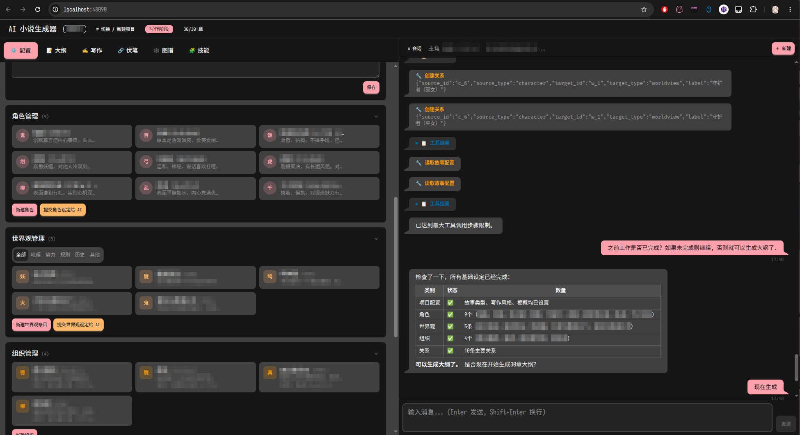

<p align="center">
  
</p>

# Show Me The Story — AI Novel Generator

> 中文文档：[README.md](README.md)

A self-contained AI tool for writing full-length novels. A single executable with a built-in web UI: point it at any OpenAI-compatible API (OpenAI, DeepSeek, a local Ollama / LM Studio, etc.) and it will plan the story dynamically and write it chapter by chapter.

The program ships with no story content of its own — the genre, world, characters, and writing style are all configured by you, or generated by the AI on demand.



## Highlights

- **Single executable**: one binary plus a browser, no database or other dependencies
- **Multi-project**: each novel lives in its own project; switch / create / delete freely
- **v4 project format**: only explicitly marked v4 projects open; the project list marks older formats and recommends the matching app version
- **Dynamic batch planning**: plan 1–36 chapters at a time and replan the last entirely unwritten batch; a long-term direction is optional
- **Chapter review**: after each chapter, confirm or request revisions; the AI does targeted, minimal edits without disturbing other chapters
- **Auto-confirm mode**: optional toggle that lets the AI confirm each chapter and continue automatically to the end of the current plan; it can be flipped on or off at any time
- **Structured settings**: characters, world, organizations and relationships are managed separately and injected into the writing prompt as needed; AI can also generate the initial set in one click
- **Relationship graph**: visualize the network of characters, organizations, and world entries
- **Foreshadow system**: AI plans foreshadows, injects active ones during writing, then tracks planted → progressing → resolved automatically; warns when a foreshadow is overdue
- **Narrative memory**: after each chapter, the AI automatically extracts key narrative details not captured in the outline (character habits, specific promises, prop details, etc.) and injects them into writing prompts across chapters, bridging the rolling-summary information gap
- **Fact-check**: each chapter is automatically checked for consistency; failures trigger an automatic rewrite
- **Continue an existing novel**: paste your existing text, the AI extracts settings and chapter summaries, and continues from where you left off
- **De-AI polish**: built-in polish skills (forbidden AI clichés, colloquial rewriting, etc.); one-click polish per chapter from the writing page
- **Final proofreading**: after formal completion, run conservative language-only proofreading; plot, structure, and foreshadow issues stay in a clickable manual report
- **Skill system**: built-in writing / polish skills can be toggled on; custom skills can be reused across projects
- **AI assistant**: a built-in chat assistant can read and modify settings, outlines, and chapters via conversation (with multiple guards on destructive operations)
- **Streaming output**: generation streams token by token, with a log panel and progress indicator
- **Resumable**: progress is persisted on every step; close and reopen the program to pick up where you left off
- **Export**: separately download the manuscript, all chapter outlines, and the proofreading report; each chapter is also saved as Markdown
- **Multilingual**: each project chooses Chinese or English; AI prompts, generated prose, built-in skills and the agent's system prompt all follow the project language; the UI language can be switched independently

## Quick start

### 1. Get the binary

Download the release for your platform, or build it yourself (see the "Development" section at the bottom).

> [!WARNING]
> **Windows users**: On first launch you may see a "Windows protected your PC" SmartScreen warning showing "Unknown publisher". This is because the app does not have a code signing certificate. Click "More info" → "Run anyway" to proceed, or right-click the exe → Properties → check "Unblock" → OK.

> [!NOTE]
> The program only requests network access to call the LLM API and check for version updates. No user data is collected or uploaded.

### 2. Run

```bash
./show-me-the-story            # data lives in the current directory
./show-me-the-story ~/novels   # or point it at a data directory
```

Then open `http://localhost:48090` (the port can be overridden via the `PORT` environment variable).

### 3. Configure the API

On first launch you will be asked to create a project. Once a project is open, the "Config" page asks for:

- **API base URL**: OpenAI-compatible base URL (the app appends `/chat/completions`), e.g. `https://api.deepseek.com`, `https://api.openai.com/v1`, `https://api.z.ai/api/paas/v4`; a bare hostname gets `/v1` added automatically. For non-standard paths (e.g. z.ai Coding Plan), enable **Strict URL mode**
- **Model name**: e.g. `deepseek-chat`, `gpt-4o`
- **API key**: leave empty for local models

API configuration is shared across all projects.

### 4. Start writing

1. **Configure the story**: on the Config page set genre, novel title, target words per chapter, writing style, etc. Characters / world / organizations / relations can be added manually, or generated in one click with "AI generate settings".
2. **Generate batch outlines**: on the Outline page, enter a required batch synopsis and a chapter count (1–36), optionally adding a long-term direction. New batches append to existing outlines. Generating 12 chapters, then 24, creates batches for chapters 1–12 and 13–36, each with its own synopsis. Prose generation uses the synopsis of the chapter’s batch.
3. **Write chapter by chapter**: on the Writing page, click generate. The AI streams the prose → produces a summary → fact-checks → waits for your review. Confirm to move on, or leave feedback to have the AI revise (select a passage and click **Quote** to revise only the matching paragraph; falls back to full-chapter revision if localization fails).
4. **Want it hands-free?** Toggle "Auto-confirm": the AI will keep writing chapter after chapter to the end of the current plan. You can toggle it off at any time.

### Choosing the project language

When creating a project, you pick **Chinese** or **English**. This drives:

- AI prompt templates (outline / chapter writing / fact-check / etc.)
- All AI-generated prose
- Built-in skills loaded for the project
- Agent system prompt and injected context labels

The project language is fixed at creation time. The UI language defaults to the project language but can be switched independently from the top-right toggle in the header.

## Core features

### Continue an existing novel

On the empty Outline page, import existing text. Imported chapters appear under “Imported chapters”. Enter a new batch synopsis and chapter count to continue. A completed project can resume directly only before final-proofreading edits; afterward, create a continuation project from the proofreading page.

### Batch planning and replanning

The Config page no longer edits a whole-book synopsis. Each batch has a required synopsis and its own chapter range. New batches append even when earlier outlines are still unwritten.

Only the last entirely unwritten batch can be replanned. Choose “Replan this batch”, edit its synopsis and count, then confirm replacement; earlier batches remain intact. Failed generation preserves the old batch and form input. The header displays the saved novel title, or “Untitled”.

The assistant’s `generate_outline` accepts `chapter_count` and `outline_synopsis` directly; it appends by default. Replanning uses `mode=replace_last`, the batch ID from `read_outline`, and explicit confirmation.

### Batch endings and long-term direction

Choose continued serialization, a book ending, or a complete book with room for a sequel. Endings can be closed, open, or custom. An open ending still establishes the main outcome. After accepting the planned final chapter, review foreshadows and mark the book complete yourself. Appending beyond it requires confirmation to remove the previous planned-ending marker.

Use “Long-term direction” for goals spanning multiple batches, such as “The protagonist turns from revenge to protecting others and eventually uncovers why the dynasty fell; this batch only finds the first clue.” It guides batch planning without requiring this batch to reach the ending or rewriting existing outlines or prose. It is saved after successful generation and reused next time.

### Linked facts and automatic setting updates

Long-form writing retrieves relevant facts and settings locally, then injects original records within a budget. Entity names and direct relationships take priority; an empty match does not load the whole registry. Very long fields use clearly marked sentence excerpts, and updates based on excerpts require review. Complete records and provenance remain stored. Keyword retrieval may miss aliases or paraphrases.

The Writing page marks passages linked to key facts. Inspect all identified passages for a fact, jump across chapters, and return to compare them. Editing or deleting a linked passage requires confirmation; a changed chapter version requires a fresh review. AI paragraph revision preserves facts by default. AI may miss links, and confirming an edit does not automatically correct other chapters.

Accepted chapters automatically update characters, world entries, organizations, relationships, and the graph. Conflicts with author settings appear as before/after proposals on the Writing page. Editing or deleting source prose safely withdraws automatic changes or requests review when later dependencies exist. Failed sync preserves prose and offers a retry; automatic writing pauses. Only newly generated or actively edited chapters participate; untouched old prose is not backfilled.

### Foreshadow system

Once the outline is confirmed, the AI can suggest 3–8 foreshadows (with planted chapter and expected resolution chapter), or you can create them manually. Active foreshadows are injected into the writing context, and after each chapter the AI updates their state automatically:

```
planted → progressing → resolved
                     → abandoned
```

If a foreshadow goes more than 3 chapters past its expected resolution chapter, you get a warning.

### Settings reconciliation

Changed a character / world entry after writing several chapters? When you save, the program offers "settings reconciliation": the AI compares the new settings with what you have already written, produces a compatible version of the settings, and regenerates the outline of any unwritten chapters so the story remains consistent.

### Quote-based paragraph revision

While reviewing a chapter on the Writing page, select a passage in the preview and click **Quote to feedback**. The selection is inserted as a `> ` quote line in your revision notes. On submit, the AI rewrites only the natural paragraph(s) containing the quoted text; if the quote cannot be located or the model returns the wrong number of paragraphs, it falls back to minimal full-chapter revision.

### Skills

On the Skills page you can enable built-in skills:

| Skill | Type | Effect |
|-------|------|--------|
| Chinese de-AI polish | Polish | 23 forbidden patterns + cliché-to-natural rewrites + colloquial rules |
| Story de-slop audit | Polish | 6-gate AI-fingerprint detection workflow with human-writer baselines |
| Writing craft | Writing | Chapter opening / closing hooks, payoff density, pacing |

All skills are disabled by default. Enabled skills are injected only into their declared scopes (chapter generation, polish, outline, final proofreading, and so on), and the live log lists the skills actually activated for each task.

The Skills page can install pasted Markdown, one `.md` file, a ZIP, or a browser-selected folder. User skills live in the global `skills/<id>/` library and can be enabled independently per novel project. A standard package contains `skill.json`, `SKILL.md`, and optional text resources under `references/`, `templates/`, or `assets/`; scripts and binaries are never executed.

Non-built-in skills show an AI validation state. An unvalidated skill displays `!` and may still be enabled; skills marked as needing optimization or failed cannot be enabled. AI Optimize creates a separate copy and immediately revalidates it. Any content change invalidates the previous report.

English projects ship with English equivalents (`humanizer-en`, `story-deslop-en`, `writing-craft-en`); the skill list is filtered by project language automatically.

### Final proofreading and continuing a finished story

Final proofreading is a separate terminal workflow after writing. Accept every chapter, formally complete the book, then open **Final proofreading** from the sidebar:

1. Download the **unproofread manuscript** and **all chapter outlines** when prompted.
2. **Proofread full manuscript** fixes spelling, grammar, repetition, dialogue naturalness, and style while preserving plot, facts, foreshadows, and paragraph structure. Style preferences and enabled polish skills remain subordinate to that boundary.
3. **Generate interactive report** lists logic, structure, foreshadow, and character issues that need author judgment. Click any chapter/block reference to edit the source, then mark it pending, resolved, or ignored.
4. Automatic changes can be undone per chapter. Download the current manuscript and Markdown report separately for external editing.

Once prose is changed in this workflow, the original project cannot resume writing. To continue the story, enter a new project name and choose **Create continuation**. The app copies frozen settings, facts, outlines, summaries, and a foreshadow snapshot—but not proofread prose—and opens the new project at the next planning chapter. Chapter progress counts only chapters added in the new project. Copied foreshadows are marked **Inherited** and remain self-contained instead of depending on the source project. The original project and downloaded backups remain untouched.

### AI assistant

The chat panel on the right (or the dedicated "Assistant" page) is an AI that can act on the project: read settings, change characters, adjust the outline, revise chapters, and so on through conversation. Destructive operations require the AI to confirm with you first, and chapter edits are always minimal targeted revisions rather than wholesale rewrites.

#### What the assistant can do

| Category | Examples |
|----------|----------|
| **Read** | "What's the current outline?", "Show chapter 3", "List all characters" |
| **Settings** | Create / edit / delete characters, world entries, organizations, relations |
| **Config** | Change genre, novel title, words per chapter, writing style and POV; synopsis and count belong to each outline batch |
| **Dynamic planning** | Plan 1–36 chapters at a time or replan the last entirely unwritten batch; written prose remains unchanged; long-term direction is optional |
| **Writing** | Generate chapter, confirm chapter, revise a specific chapter, quote-selected paragraph revision, surgical paragraph edits |
| **Foreshadows** | Suggest, create, update, delete foreshadows |
| **Skills** | List skills, toggle skills on/off |

#### Recommended for the assistant

- **Bulk settings**: "Create 5 main characters from the synopsis", "Add a world entry about the magic system"
- **Outline tweaks (same chapter count)**: "Make chapter 5 a rainy-night clue discovery", "Speed up the pace and bring the villain in earlier"
- **Single-chapter revision**: "Chapter 8 dialogue feels stiff — make it more colloquial", "Strengthen the cliffhanger at the end of chapter 3"
- **Surgical edits**: "Replace lines 12–15 in chapter 6 with a tenser description"
- **Queries**: "Where am I in the story?", "Which foreshadows are still active?"

#### Possible via assistant, but verify the result

- **Replan the last batch**: “Replan the last unwritten batch as 12 chapters, with this synopsis: …”. The assistant reads the batch ID and requests confirmation; earlier batches remain unchanged.
- **Config changes after confirmed chapters**: saving may trigger settings reconciliation and regenerate pending outlines — can take a while.
- **Async tasks**: outline/chapter generation and revision run in the background; watch the log panel and wait for the task to finish before sending the next message.

#### Better done in the UI (not the assistant)

| Task | Prefer |
|------|--------|
| **Final proofreading** | Formally complete the book, open the dedicated page, export backups, then proofread or work through the interactive report. |
| **Continue / import existing text** | Outline page → Import existing content. |
| **Relationship graph layout** | Relations page (Canvas drag/zoom). |
| **Reset entire project** | Dangerous; if needed, say "reset all progress" explicitly and confirm the range the assistant restates. |

#### UI buttons vs assistant

- **Page buttons**: generate / confirm / revise / delete — clear state, predictable; **default choice** for core workflows.
- **Assistant**: good when you need explanation, multi-step queries, or one-sentence intent; for complex flows (chapter-count regeneration and final proofreading) prefer the UI.

#### How to phrase requests

- **Replan the last batch**: “Replan the last unwritten batch as 12 chapters, with this synopsis: …”. The assistant reads the batch ID and requests confirmation; earlier batches remain unchanged.
- **Content change, same structure**: "Revise the outline: add a foreshadow in chapter 3, do not change the chapter count".
- **Edit chapter prose**: "Revise chapter 6: …" — do not say "delete chapter 6" when you mean edit.
- **While a task runs**: wait for the "AI thinking" badge to clear, or click Stop before sending a new command.

#### Safety guards (summary)

1. Editing a chapter ≠ deleting it; the assistant must not use delete tools for edits.
2. Delete operations need your explicit confirmation after the assistant restates the scope.
3. Fields you already filled on the Config page are not overwritten silently.
4. Only one AI task at a time; editing is disabled while a task runs.

## Data and files

Everything is local plain text / JSON:

```
<data dir>/
├── api.json                 # API configuration (shared by all projects)
└── storys/
    └── <project name>/
        ├── config.json      # story configuration + prompts + skill flags
        ├── progress.json    # progress, outline, chapter metadata, foreshadows
        ├── chapters/        # chapter prose (NNNNNN.json)
        ├── settings.json    # characters / world / organizations / relations
        ├── sessions/        # assistant chat history
        ├── Chapter_XX.md    # Markdown copy of each chapter
        └── Foreshadows.md   # foreshadow roadmap
```

To back up or migrate, copy the data directory.

## Recommended limits

Writing context now has a fixed budget instead of growing without limit. It keeps the latest 20 chapter summaries and the previous chapter ending, retrieves older outlines by relevance, and includes at most 10 future outlines. Facts, settings, and foreshadows are also selected within bounded contexts. Every request reserves room for model output and tokenizer variance; if the conservative estimate exceeds `context_budget_tokens`, it stops before contacting the provider.

After a work exceeds 40 accepted chapters, the next writing, batch-planning, or planning-review task compresses history older than the latest 20 chapters into persistent 20-chapter checkpoints. Every ten sibling checkpoints are compressed into the next level. Editing or deleting an old chapter invalidates and rebuilds the affected summaries; if the compression call fails temporarily, a bounded local fallback is used without blocking continuation.

The model still needs enough context for the requested chapter output, current batch synopsis, and bounded knowledge context. A larger window does not by itself guarantee better long-range consistency; models also differ in how effectively they use supplied context.

### Proofreading model calls

Automatic proofreading and report analysis process one chapter at a time, so the model does not need to hold the entire manuscript in one request. Failed chapters remain unchanged and can be retried; cancellation keeps chapters already saved. The prompt enforces one-to-one paragraph mapping, but authors should still sample-check AI edits and keep the prompted backups.

### Notes for very large books

- **Context budget**: when the model endpoint reports its real window, the app automatically clamps an oversized setting. Otherwise configure it manually; a smaller value triggers local protection earlier.
- **Outline generation**: each batch remains limited to 36 chapters. Planning uses hierarchical checkpoints, recent batches, and relevant older chapters instead of the complete historical outline.
- **Fact-check**: up to three retries can increase total token spend, while every individual request remains budget-limited.
- **Foreshadow system**: only unresolved threads and their latest three progress events are injected; complete history remains stored in the project.
- **Narrative memory**: the token budget scales with book size (up to 20000 tokens), so longer novels get a larger memory bank to retain more early details.

> **TL;DR**: hundreds of chapters no longer make each prompt grow linearly through complete historical outlines. Hierarchical summaries preserve the distant arc, BM25 retrieval supplies precise facts and settings, and the final budget check prevents oversized requests.

## Notes

- Only one AI task runs at a time; editing is briefly disabled while a task runs. You can stop it at any time with the "Stop" button.
- Transient network errors retry automatically (with exponential backoff). Fatal errors such as an invalid API key stop immediately with a message.
- Advanced users can override any built-in prompt template by editing the `prompts` field in `config.json` (placeholders are of the form `{{.KeyName}}`).
- Old projects without a `language` field are treated as Chinese; existing prompt overrides are preserved.

---

## Development

### Stack

- **Backend**: Go 1.25+, standard library only, zero third-party dependencies
- **Frontend**: Vite 5 + Svelte 4 + Tailwind CSS 4 + DaisyUI 5, build output embedded into the binary via `embed.FS`
- **Transport**: REST API + SSE for live events

### Build

You need Go, Node.js, and optionally [Task](https://taskfile.dev/):

```bash
# Recommended: one-shot full build (frontend + backend)
task build

# Or step by step
cd frontend && npm install && npm run build && cd ..
go build -o show-me-the-story .
```

### Dev mode

```bash
task dev            # build + start the Go backend (:48090)
task dev:frontend   # start the Vite dev server (:5173, HMR, proxies /api → :48090)
```

### Project layout

The backend is organized into layered Go packages under `internal/`: `httpapi` (routes and handlers), `agent` (the assistant agent loop), `story` (domain logic: outlines, writing, foreshadows, import, ...), `llm` (OpenAI-compatible client), `config` (configuration and prompt templates), `sse` (event broadcasting), `i18n` (bilingual messages), plus `prose` / `fsutil` utilities. Frontend pages live under `frontend/src/pages/`.

The full architecture, API endpoint list, SSE event reference, design patterns, and development guidelines are in [AGENTS.md](AGENTS.md).

## Star History

<a href="https://www.star-history.com/?repos=Nigh%2Fshow-me-the-story&type=timeline&legend=top-left">
 <picture>
   <source media="(prefers-color-scheme: dark)" srcset="https://api.star-history.com/chart?repos=Nigh/show-me-the-story&type=timeline&theme=dark&legend=top-left" />
   <source media="(prefers-color-scheme: light)" srcset="https://api.star-history.com/chart?repos=Nigh/show-me-the-story&type=timeline&legend=top-left" />
   
 </picture>
</a>
